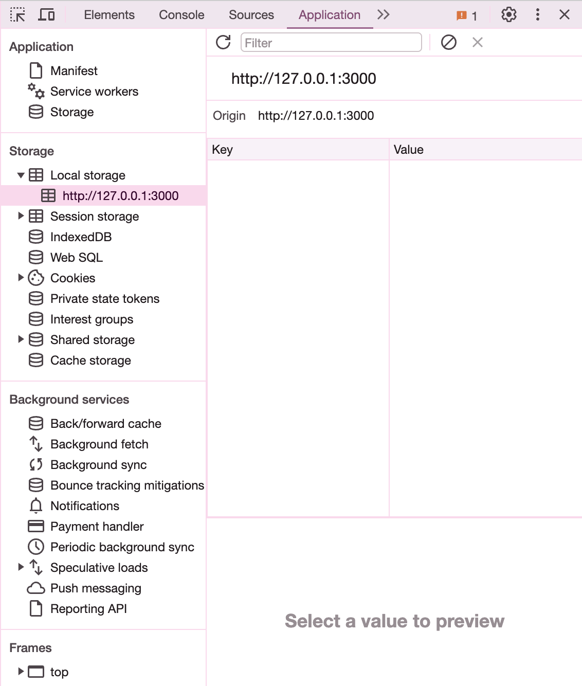
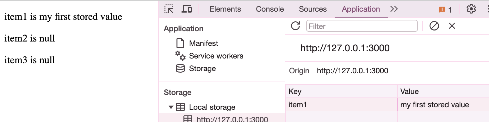

# Week 7 Practical 2: localStorage

In this practical you will design and implement client-side data storage to improve the user experience for a handful of webpages. 

## Stage 1: Viewing / modifying localStorage via Chrome for debugging purposes

It's often helpful to be able to see / edit localStorage key-value pairs in the browser so you can tell if your code is working and fix any problems created by broken code.

Run stage1/index.html in Chrome. You will see three paragraphs that say:

```
item1 is null
item2 is null
item3 is null
```

Look at the code in main.js. The first three lines of code are retrieving stored values with the keys `item1`, `item2`, and `item3`. Because we haven't stored anything with these keys yet, the values will be null. 

The rest of the code creates a paragraph for each item and displays it in the `div` with id `output`.

Next, add some data to localStorage using Chrome (not code):

- Open Chrome Developer tools and go to the Application tab.
- Find localStorage under the heading "Storage". If this item is collapsed, click the heading to open it. You should see a URL that matches the URL of the page running in your browser. Click on the URL to see the data it has stored in localStorage.
- You will see an empty table with column headings "Key" and "Value".



- Double click in table just under the "Key" heading. When the row becomes editable, type `item1`. Double click in the "Value" column next to `item1` and type a message.
- Refresh the page and you should see the first paragraph update to show the value you have added.

- If you close and reload the tab, you will see that the key-value pair is still in localStorage. localStorage is browser-specific. So, if you run the HTML page in a different browser, it will not have any data.
- Add `item2` and `item3` to localStorage. Try storing values of different data types.
- You can edit existing values in localStorage - double click on the value and change it.
- Try deleting data: right-click on the key name to delete the pair.

## Stage 2: Getting and setting simple storage data
You will need your completed code for last practical, exercise 2.1 (the theme selector). You can also use the sample solution for that exercise. The website that you created for exercise 2.1 in the last practical allowed the user to change the theme of the website. Enhance that website by saving the user’s preference in `localStorage`. If the user has a saved preference, the website should automatically render using their preferred theme. Here are the steps:

1.	Decide the structure of the stored preference data. There are multiple possible structures that would be appropriate.

2.	When your script loads, it should check if the user has a preference. Remember from lecture that you can check if a key exists in `localStorage` using `localStorage.getItem(keyName)`. If the key does not exist, `getItem` will return `null`.

3.	If and only if the user has a saved preference, apply the preferred theme AND set the corresponding radio button’s checked property. 

4.	When the user chooses a different theme, update the stored theme using `localStorage.setItem(keyName, value)`

If you are storing data in a form more complex than a basic string (e.g. an object literal). Don't forget to use `JSON.stringify(yourData)` to correctly format the data for storage, and `JSON.parse(localStorage.getItem("yourKey"))` to convert the stored data back to its original type.

Test that everything is working by choosing a new theme then closing your browser and reopening the page. If everything has worked, the selected theme should be remembered.

## Stage 3: Storing more complex data
This stage is significantly more challenging. Try to complete it by yourself but remember that you can always consult the sample solutions.

### Exercise 3.1: Store contact form data
You will need the completed cat adoption agency contact form you created for Week 4 Practical 2. You can also use the sample solution if you prefer.

At the moment, nothing happens to the data entered in the form. If this were a real adoption agency website, enquiries sent via the contact form would at the very least be emailed to someone at the agency. They may also be sent to a database that would allow the agency to keep track of all enquiries.

In this exercise, you will store the contact form data in `localStorage`. Local storage would not be an appropriate storage location for contact form data in a real application but you're being asked to complete this task to gain experience working with more complex data in JSON.

When the submit button is clicked AND all data is determined to be valid (required fields are filled in), create a JavaScript object literal that stores all the data entered by the user.
- Remember that some questions in the form have follow up questions, so you will have to think about how to store those responses too.
- If that feels too challenging, remove the follow up questions from the form.
- When you are done, try printing out your object literal to check that everything looks alright. For example, here is what mine looks like for someone with no kids and one other pet:

```
{
    children: "None",
    email: "harry@wizards.com",
    fullName: "Harry Potter",
    otherPets: ["bird"],
    outsideSpace: false,
    phone: "01234 123456"
}
```

The last step in this exercise is to store your object in `localStorage`. 
- Don’t forget to convert the data to JSON using `JSON.stringify(someObject)`.
- Check that your object is stored properly by typing `localStorage` in Chrome’s JavaScript console OR by going to the Application tab in Chrome Dev Tools as you did in stage 1. You may see backslashes (`\`) in your stored data. This is OK. The backslashes are added automatically when string data contains double quotes. The backslashes will be removed when the data is converted back to a JS object. 

### Exercise 3.2: Working with JSON arrays

Continue working with the cat adoption contact form. If you fill the form in a few times and check the contents of localStorage, you’ll see that the saved data gets overwritten every time the form is submitted. Next, adapt your code so that it stores an array of objects, rather than a single object at a time. Objects can be added to arrays in the same way as other types of data.

After two form submits, the data might look something like this:

```
[
  {
    children: "None",
    email: "harry@wizards.com",
    fullName: "Harry Potter",
    otherPets: ["bird"],
    outsideSpace: false,
    phone: "01234 123456"
  },
  {
    children: "8 and 10",
    email: "someone@email.com",
    fullName: "A Person",
    otherPets: [],
    outsideSpace: false
  }
]
```

The steps to implement this are quite similar to the clock example in lecture. Here are some reminders:

- When the form is submitted, check if `localStorage` already contains saved data. If there is no data associated with the key you are using to save data, `getItem` will return null.

- If `localStorage` does not contain any saved data for your key, create a new array.

- If `localStorage` does contain an array already, convert it to a JavaScript array using `JSON.parse(savedData)`. Note: if your local storage contains data from the previous exercise, you will probably need to delete it before implementing this step. You can do this by typing `localStorage.clear()` in the browser console or by manually deleting it as you did in stage 1.

- Convert the array to JSON using `JSON.stringify(yourArray)` and save it to `localStorage` using `localStorage.setItem(key, value)`. 

Make sure everything works by submitting the form a few times and printing `localStorage` to the console or checking the Application tab in Dev Tools.
